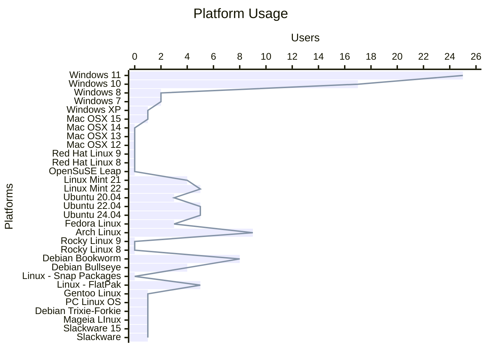
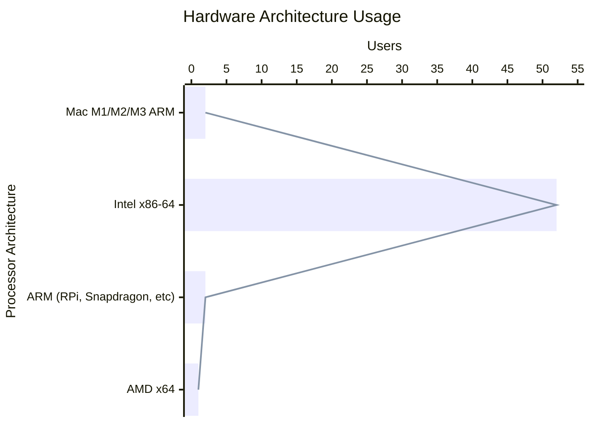

# Overview
In October 2024 the Vega Strike Development team put out a [survey](https://www.vega-strike.org/blog/2024/10/30/community-survey/); and
today we'd like to share the results for the 53 responses we received. While not a lot of responses, it will be used to help inform
the team. We'll repeat similar surveys in the future.

The primary purpose of this survey was to help us target our CI system for what builds we focus on and what systems we make releases for.
Please keep in mind that the questions allowed people to make more than one selection; so the totals between different sections may add up to more than the answers received
and not match other sections.

## Platform: Operating Systems

We have been building on a lot of platforms as we were (a) guessing where our community might be, (b) trying to target popular platforms, and (c) covering platforms the
current development team uses themselves. This survey provides us with the first bit of data to refine those based on your feedback.

Results:

From this we can see that the majority is currently running on Windows (47 users across the various versions), followed by Linux users across a few different distros (57 users
across Mint(9), Ubuntu(13), Fedora (3), Debian(13), FlatPak(5), Mageia(1), Slackware(2), Arch(9), Gentoo (1), PCLinuxOS (1)).

Now, at the time of the survey we had only released binaries for the Linux Platforms, and we do not have direct support for FlatPak yet (though we are aware that someone in the
community has at least tried to make a FlatPak build). So it would be natural to expect to see more Linux users at this time. The primary reason for this support was simply
that we were still working out kinks in the Windows and Mac builds and had not yet developed installers for them as of Vega Strike 0.8.0. Since then we have released
Vega Strike 0.9.0 with binaries for Windows and Mac; though our Mac builds are presently limited to the Intel platform.

## Platform: Hardware

We also asked about Hardware Architectures:

NOTE: AMDx64 is almost certainly the Intel x86-64 architecture. Technically  x86-64 is the AMD64 Architecture; however, most will know it as Intel. We're reporting it here as AMDx64 to reflect how the community submitted it.

We do see some desire for ARM-based releases; though as expected the majority are all x86-64 users.

We are aware that Apple is moving away from Intel and newer Macs are only on their M-series ARM processors.
We have attempted to support the M-series in our pipeline - GitHub does support it; however, it has been
problematic for us to support as there have been some build issues and we do not have anyone on the team
to fully diagnose those right now.

So if you would like to see us support the M-series then it would be greatly helpful if you could join
our Gitter.im channel. We could really use some folks that can build the project locally, even if we needed
to help out with getting things setup. Or even if you wanted to provide access to teams members in some form.

Alternatively, the we do have the ability to collect donations through [OpenCollective](https://opencollective.com/vega-strike).
Our funds there are presently very limited, and our goal is to be able to pay back those in the community that
are already providing resources (DNS, Servers) and cover any storage costs we may need to for our CI system
(presently supported via the Open Source plan with Docker Hub). However, if there were sufficient funds we
could also support using services like https://www.macincloud.com/ to provide developers access to the Mac
Platform to help iron out those issues and deliver better Mac support.

## General Feedback

Finally, our survey included some basic feedback via free form text.

While most of the feedback was thanking us there were a few items called out:

1. Some issues with mission files not working in 0.8.x so the game was crashing
2. Request for VS to become an MMO
3. Request to be able to walk around the planets
4. Request for an in-game 3D map of the VS universe, referencing the old [VSMap3D](https://sourceforge.net/projects/vsmap3d/) project
5. Request for better documentation/tutorials
6. Request for FlatPack/AppImage releases
7. Request for Windows releases
8. Request for generative AI usage
9. Request for updating the pipeline to use something like Blender, support mods, etc.
10. Steam Publication

First, we welcome all feedback and we have multiple ways for users to submit feedback to us. The best way to provide feedback it so
get on GitHub and direclty file issues with us [VS Engine Bug](https://github.com/vegastrike/Vega-Strike-Engine-Source/issues),
[VS:Upon The Coldest Sea Bug](https://github.com/vegastrike/Assets-Masters/issues), or engage with us in conversation on [Gitter.im](https://gitter.im/vegastrike/community).
Alternative we do have some email addresses:

- [Development](mailto:devel@lists.vega-strike.org)
- [Security](mailto:security@lists.vega-strike.org)

And of course there is the [VS Forums](https://forums.vega-strike.org/).

While the team is most active on Gitter.im and GitHub, we do also pay attention to the other methods as well.

### MMO Support

The original developers had built in some multi-player support similar to that of Wing Commander Armada and other games from the 1990's where one could direct-connect
with another user to play. However, we received feedback from those involved with the original dev team that it was not working and as our new dev team was just getting
familiar with the code we made the decision to remove that support for the time being. We also had to initially drop support for Windows and Mac due to what our dev
team could manage.

Our first target was to get the game functional again, which we were able to do with the 0.7.0 and 0.8.0 releases. After that we wanted to re-introduce support
for Windows and Mac, which was accomplished with the 0.9.0 release; though due to changes on the Mac platform we may have to drop support there temporarily again due
to issues on the M-series processors. For 0.10.0 we are working on settings and other functionality and the team has developed enough expertise to begin making some
more radical refactors as we work our way towards the 1.0 mark where we have a solid game that we can build from. There is still much to do.

Now regarding multi-player support in any form, the current idea is to target that work for the 2.0 releases. And the best way to speed that up would be to
join us on the development team or sponsor developers so we could have developers with more dedicated time to Vega Strike - at present all our devs are 100% volunteer
and also have to be able to support themselves and their families via other jobs.

### Walk the Planet

From some conversations with members involved with the old dev team we are aware there were some thoughts around doing this kind of thing. However, we do not ourselves
know yet how to extend the game for this. So presently we will need to keep this in the backlog for a future addition so we can focus on getting to that 1.0 release mark.

### In-Game 3D Map of the VS Universe

We are not sure where this presently falls. Certainly an in-game map would be a new feature and we do not yet have bandwidth to take on a new feature. However, we might
be able to help ressurect the VSMap3D tool and bring it back for usage. And we would love to know what other tools there were too. Most of us were not part of the original
dev team and do not know all the tools that were made or utilized. We've been learning; but if there's something you think could help us then please reach out and let us
know.

So as-far-as In-Game this would need to be on our backlog of features.

### Documentation

We agree that we could always have better documentation. We want to make the game as easily access to be our users as we can. We know not everyone is a developer and
we expect that a wide range of people with a wide range of skills are going to want to use VS. Our resources are limited, however; that said one way non-developers
can help out is by getting involved to contribute documentation, updating tutorials, etc. We know there's a lot of information in the old VS Wiki, and its getting
out of date as we move forward. We'd love to have help there.

### FlatPak, Snap, AppImage Releases

We are aware that there is a desire to make these universal packages. However, they are not without their issues.

We did have a community member reach out about building a FlatPak; and are not sure where it ended up. Though at the time we were seeing issues with how the FlatPak
Platform interacts with out build environments which made it hard to move forward. We certainly welcome such efforts to add to the community, and indeed this is
how our Arch Linux users are supported as we had someone step up and make an Arch Package (AUR) for VS.

### Windows Releases

We are glad to report that with the release of 0.9.0 we have full Windows support including an Installer. We also have a Mac DMG release too for Mac Intel systems.

### Generative AI usage

We have discussed this on occassion on gitter; however we presently have so much to do that it is not a high priority for us right now. We think there can be
some very interesting things to do with enabling AI tooling to take over operating the various NPC ships, do communication, etc. So tick this one for a future enhancement.

### Updating the pipeline

The team has been very focused on building up the system that we already have. As we have done this we have updated some things; however, we know we still have a long
ways to go. And whatever we do we may need to provide the ability to migrate the old data in the game assets.

We have had discussions around various aspects of this - everything from should we keep the VS Engine or work towards running the assets on another game engine to
how do we update the rendering pipeline to use Vulkan vs OpenGL. Discussions are still on-going; and we're still learning a lot especially in this area. Most of our
existing effort has been around the code structure and usability; but we are going to have to start thiinking about the data pipelines - Vulkan, etc.

The best way to help out with this would be to join us on Gitter and GitHub to help make these kinds of transitions.

# Final Thoughts

It has been about 5 years since the new dev team has come together to pick up the mantle of VS and ressurect it. We've had a lot of challenges in that time but have
also come along ways, and are now addressing major bugs in the system that have been there for a long time - even discovering some new ones.

Our goal is to make VS the best we can make it and we hope that as we do our community will also come up along side us, grow the team, and continue building it for
the future generations to enjoy. There is much work to be done and we look forward to getting to know you all through this endeavor.

Happy Hunting!
